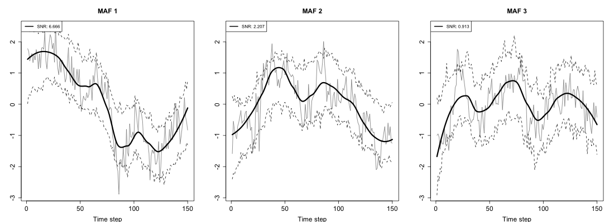

# Maf 

Maximum autocorrelation factors (MAF) are are linear combinations of a set of concurrent multivariate time series that contain the maximum amount of autocorrelation. It can be shown that if you have a data set where each time series contains a couple of smooth underlying signals corrupted by noise, that MAFs achieve the maximum signal-to-noise ratio and highest correlation with the true underlying signals.

# Install in R
You need to install `devtools` to install from github, which you can do with `install.packages('devtools')`. Then run the following,

```
library(devtools)
install_github("matzhaugen/maf")
```

# Run the example
This will extract the MAFs from a dataset containing annual treering widths. The plot function will plot the first 3 MAFs with confidence intervals, and estimate the number of MAFs in the data set. Note that I only plot the last 150 timesteps for speed and converience. If large datasets are analysed, you might consider not plotting the confidence intervals by setting `with.uncertainty = FALSE` in the `plot` command.
```
library(maf)
maf.object = maf(treeringTimeseries[850:999,])
plot(maf.object)
```




