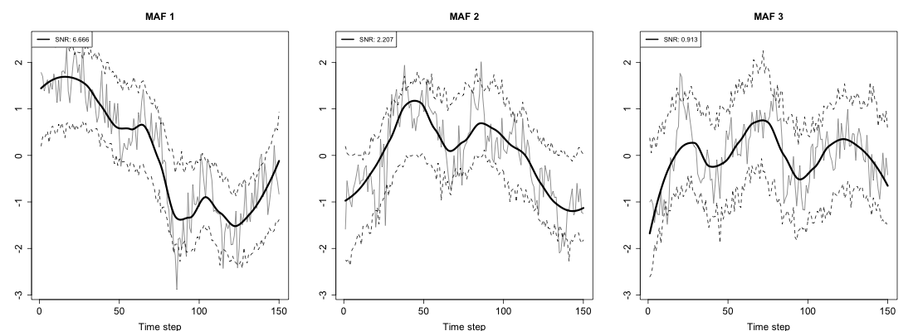
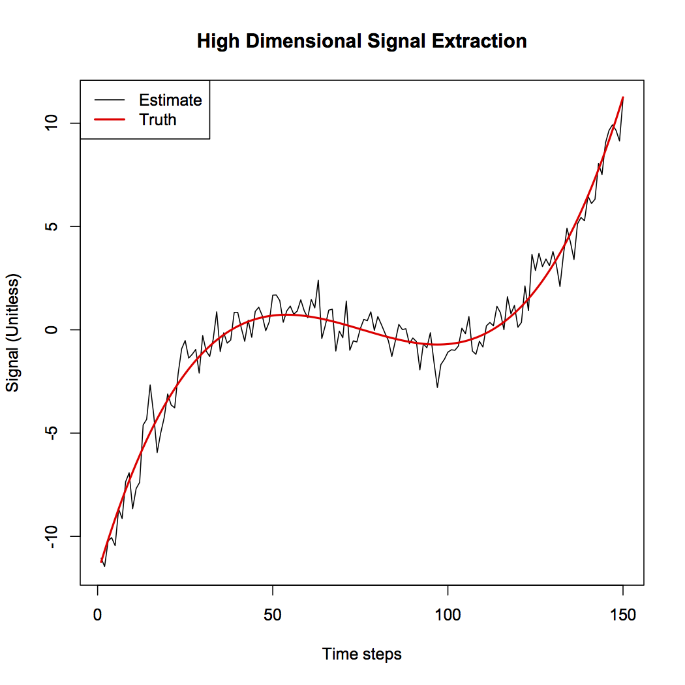

# Maximum Autocorrelation Factors 

Maximum autocorrelation factors (MAF) are are linear combinations of a set of concurrent multivariate time series that contain the maximum amount of autocorrelation. It can be shown that if you have a data set where each time series contains a couple of smooth underlying signals corrupted by noise, that MAFs achieve the maximum signal-to-noise ratio and highest correlation with the true underlying signals.

# Install in R
You need to install `devtools` to install from github, which you can do with `install.packages('devtools')`. Then run the following,

```
library(devtools)
install_github("matzhaugen/maf")
```

# Run an example
This will extract the MAFs from a dataset containing annual treering widths. The plot function will plot the first 3 MAFs with confidence intervals, and estimate the number of MAFs in the data set. Note that I only plot the last 150 timesteps for speed and converience. If large datasets are analysed, you might consider not plotting the confidence intervals by setting `with.uncertainty = FALSE` in the `plot` command.
```
library(maf)
maf.object = maf(treeringTimeseries[850:999,])
plot(maf.object)
```



# High dimensional MAF
In a situation where the number of time series is greater than the number of time steps, the regular optimization problem is ill-posed and singular. To fix the problem we employ an algorithm that divides the data into smaller groups, computes the induvidual groups' MAF time series and recombines all of them to produce one resultant MAF representative of the whole data set. An example is provided below

```
# Make a signal
n = 150 # number of time steps
p = 600 # number of time series
rho = 0.4 # noise cross correlation
cov_e = matrix(rho, p, p) # noise covariance
diag(cov_e) = 1
noise = mvrnorm(n=n, mu=rep(0, p), Sigma=cov_e)
x=seq(0,4,len=n);
signal = (x-1)*(x-2)*(x-3)
signal.sd = c(rep(0.2, p/2), rep(0.6, p/2))
signals = signal %*% t(signal.sd) / sd(signal)
data = signals + noise
result = MAFpart(data)
plot(result$out, type="l", xlab='Time steps', ylab='Signal (Unitless)', 
main='High Dimensional Signal Extraction')
lines(lm(result$out ~ signal)$fit, lwd=2, col=2)
legend('topleft', c('Estimate', 'Truth'), col=c(1,2), lwd=c(1,2))
```

The figure shows the signal estimate after signal extraction from 600 time series with 150 time steps. Half of the time series has signal-to-noise ratio 0.2 and the other half has SNR of 0.6.


